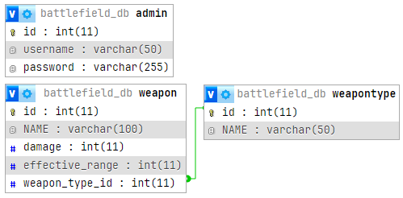

# TPE1 - Marco Fumagalli y Gino Longobucco
 
Este proyecto está diseñado para gestionar la información sobre armas del juego Battlefield 4. La base de datos permite almacenar y organizar datos relacionados con diferentes tipos de armas y las armas específicas dentro de cada tipo.

## Diagrama de la Base de Datos

El diagrama a continuación muestra la estructura y las relaciones entre las tablas de la base de datos.

## Estructura de la Base de Datos

La base de datos se compone de dos tablas principales:

- **WeaponType**: Almacena los tipos de armas, como Asalto, Francotirador, etc.
- **Weapon**: Almacena detalles sobre cada arma, incluyendo su nombre, daño, y rango efectivo.

La tabla `Weapon` está vinculada a `WeaponType` mediante una clave foránea, estableciendo una relación de uno a muchos.

## Instalación y Uso

1. **Importar la Base de Datos:**
   - Accede a phpMyAdmin y selecciona la base de datos donde deseas importar los datos.
   - Usa la opción para ejecutar un script SQL y carga el archivo correspondiente.

2. **Verificar los Datos:**
   - Revisa las tablas y datos en phpMyAdmin para asegurarte de que se han creado e insertado correctamente.

